# E-Commerce Site Review – Booktopia.com.au

Booktopia is one of Australia’s leading online bookstores. 100% Australian-owned and operated, it has a Sydney-based Call Centre and donates to many local causes.

I have chosen to review the E-Commerce capabilities of the Booktopia site as it uses many of the best practices. This section of the report will detail how Booktopia complies with these best practices as well as including a transaction with Booktopia from start to finish.

## Table of Contents
1.  [Buying a product on Booktopia](#buying)
2.  [E-Commerce features and functions of Booktopia](#features)
3.  [The content structure and navigation of the site](#structure)
4.  [Conclusion](#conclusion)

## Buying a product on Booktopia

### Step 1
To get started lets head over to the Booktopia [website](http://www.booktopia.com.au) *\[Figure-1\]*

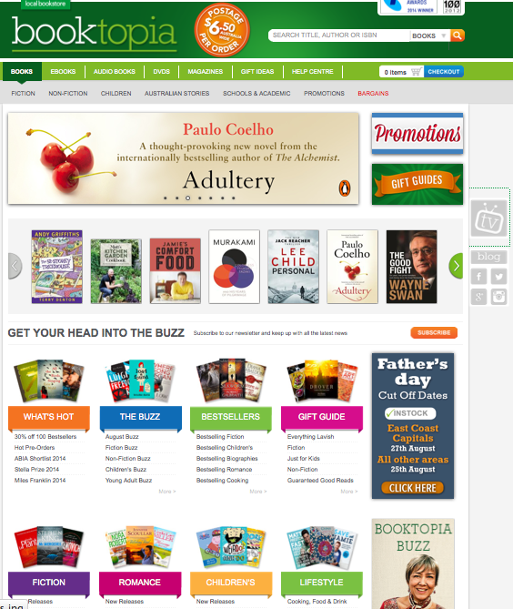

From here you can go find an item either via all the categories or by the search bar. As I’m searching for a specific product, I’m going to use the search bar.

### Step 2
After entering “dirtwater” in the search bar and selecting the DVD category, I am taken to a new page, with various filters to help narrow down the results. *\[Figure-2\]*

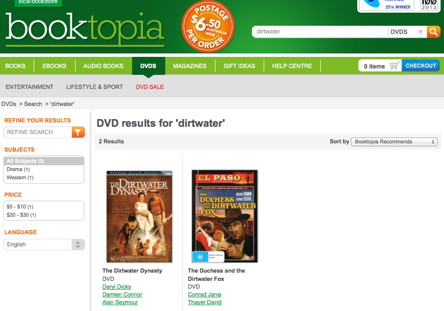

### Step 3
The product page lists a description and product details. *\[Figure-3\]*

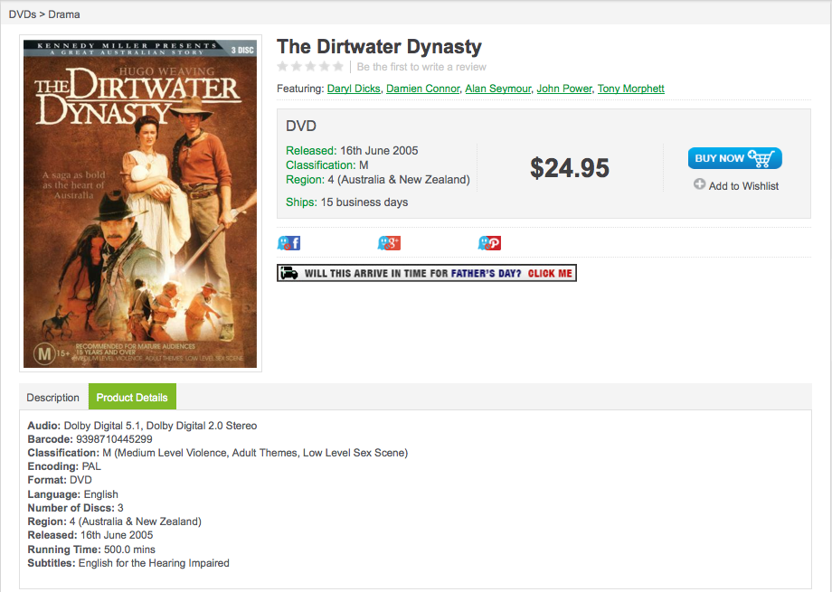

### Step 4
Upon clicking the “Buy Now” button, a window pops up with a notification of the item being added to your cart. It also has buttons helping you to view your shopping cart, proceed directly to checkout or viewing similar products to the one added to the cart. *\[Figure-4\]*

I’m going to proceed straight to checkout as I’m only buying this one item.

### Step 5
The shopping cart contains various options such as increasing/decreasing the quantity of an item in the cart, removing items as well as gifting. *\[Figure-5\]* 

### Step 6
After clicking checkout you are directed to a login/registration screen. As I’m a member already I’m going to log in. *\[Figure-6\]*

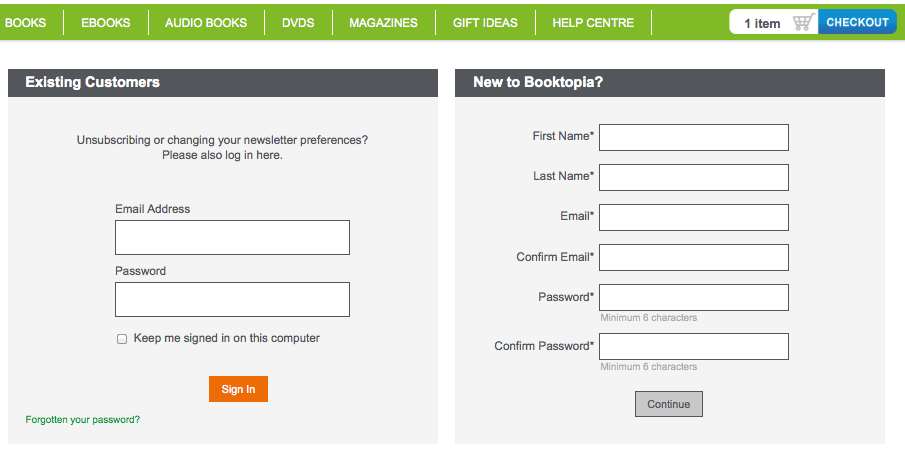

### Step 7
The Address Details page allows you to select which address you want the items to be shipped to. The next page Delivery Options confirms any special delivery instructions that may be required.

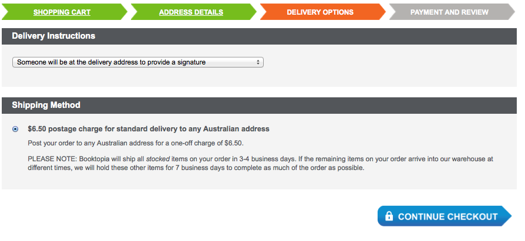

*\[Figure-7\]*

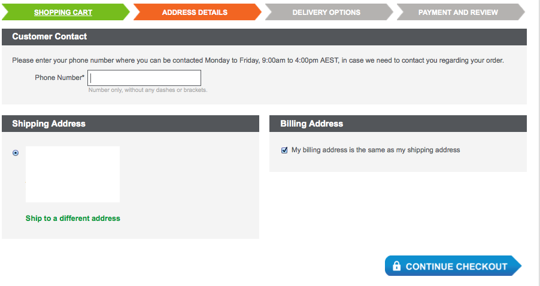

*\[Figure-8\]*

### Step 8
The Payment and Review screen shows all the shipping details, an order summary, an area to enter any discount codes and payment information. When all these are filled out, clicking the Submit Order button will complete the transaction and an invoice will be onscreen.

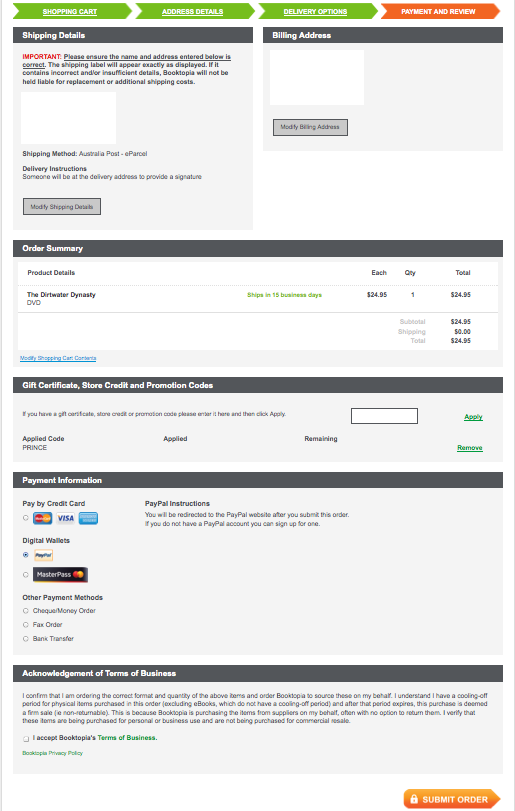

*\[Figure-9\]*
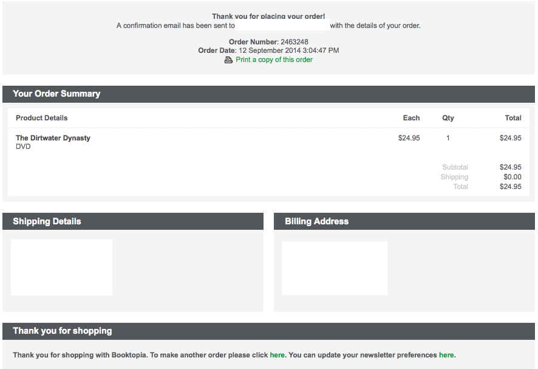

*\[Figure-10\]*

##  E-Commerce features and functions of Booktopia
Booktopia has been designed specifically to make it as easy as possible for users to quickly purchase the items they want. How they have done this can be seen throughout every level of the sale. I’ll drill down into more detail in the sections below.

### <a name="product-catalogues">Product catalogues
The Booktopia website have categorised all their products via a range of different scales. Products are categorised in the top menu by item type and genre.*\[Figure-11\]*
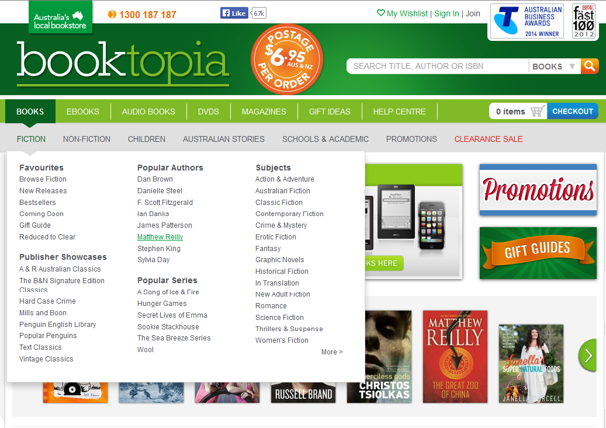

The products are also displayed by popularity on the home page.

### Shopping Cart
The shopping cart, as seen in [Step 5](#step-5), is very cleanly set out. You can increase or decrease the quantity of items you are purchasing as well as removing unwanted products.

### Payment and ordering
Booktopia offers a large range of payment methods. It allows payment by credit card, online wallets, money orders and bank transfers. You can see all the options in [Step 8](#step-8).

### Registration
Registration for Booktopia is quick and easy, required just a name, email and password to create an account. You can then use this account to store your payment details to speed up the next purchasing process.

### Customer profile management
The customer profile contains a purchase history as well as managing your details and viewing purchased e-books.*\[Figure-12\]*
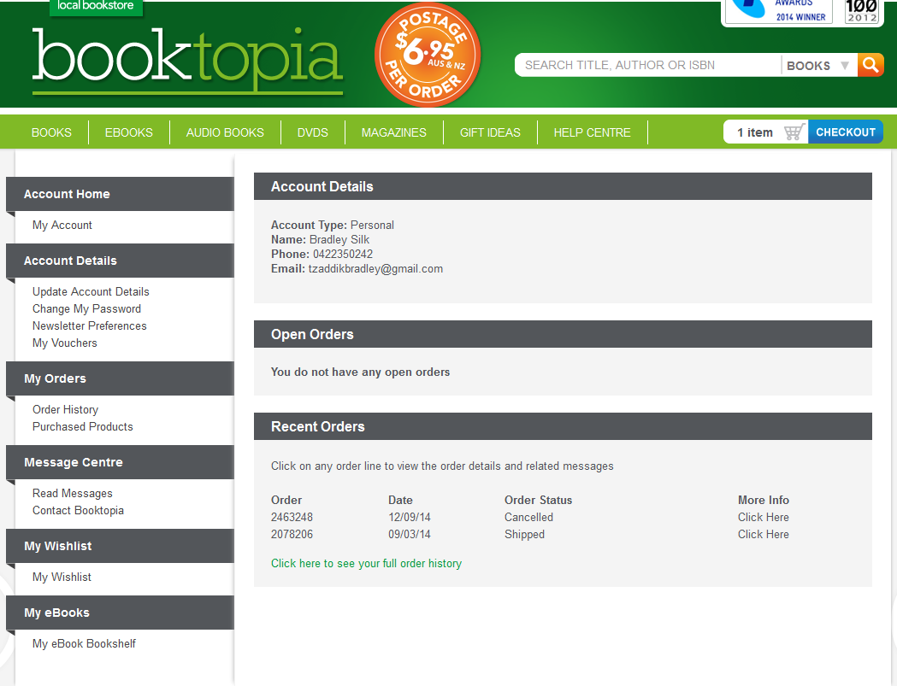

### Marketing
Booktopia uses a number of tools for marketing on its website. It advertises its latest and most prestigious awards in the top-right of the page. It also has a range of banner ads spaced around the site that advertises the latest book and movie releases as well as interviews they have done on their blog.

They also make use of the leftover space to the left and right of the site on computers with large screens. At the time of this report being written, they had visual reminders there telling users when they'd need to place their orders by to recieve their shipped items before Christmas.

### Aesthetics
The site has a very clean design with items like the logo and main menu where you expect them to be.

The menus and sub-menus are laid out intuitively and all the features behave as the base web user would expect them to.

### Security
When the shopping cart is open, and during the whole purchasing process after that, the site uses the HTTPS proticol to protect the user from having their personal data intercepted.

It has a 128-bit encryption on its SSL certificate which has been provided by GeoTrust Inc.

##  The content structure and navigation of the site
As shown in [Product catalogues](#product-catalogues), the navigation and structure of the site is extremely good. Everything is categorised by its item type and the genre it comes under.

Going to a certain product section will bring up filters in the left sidebar to help find the specific item you are looking for. *\[Figure-13\]*
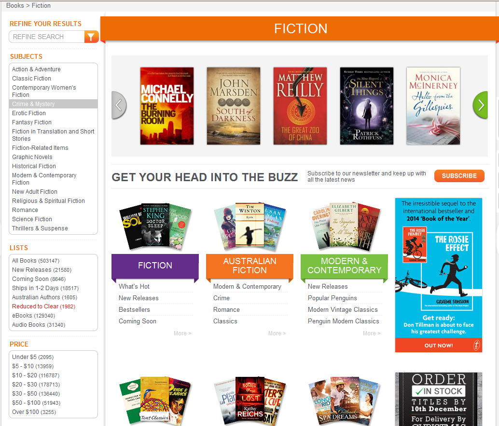

Once inside the section, for this example, inside Science Fiction in the Fiction section, even more filters will appear to really help you get to the specific item you are looking for. *\[Figure-14\]*
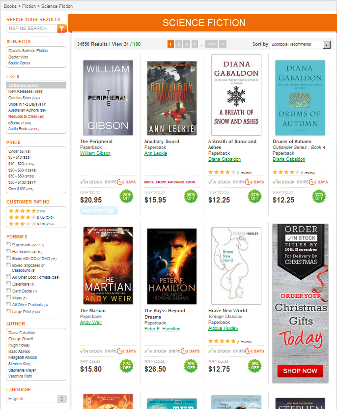

##  Conclusion
Overall, the purchasing experience on this website was easy to follow and very quick to execute.

Buying a product on Booktopia was a simple [process](#buying) of searching for what I want, adding it to the shopping cart and then purchasing it.

The excellent [e-commerce](#features) features of the site helped make the purchasing process as easy as possible.

The real [highlight](#structure) of the Booktopia website was how well it was structured and the ease of navigating to the desired product.
