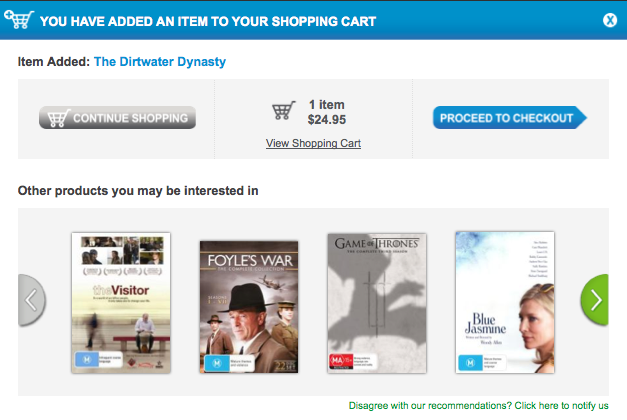
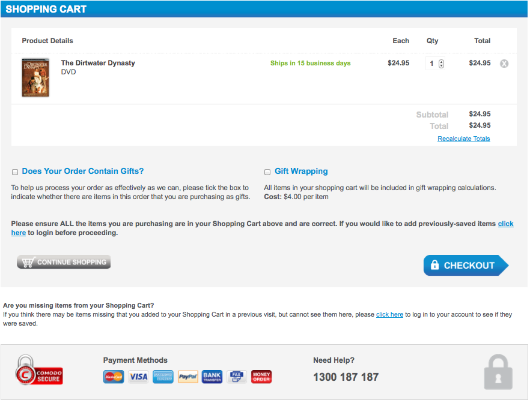

# E-Commerce Site Review – Booktopia.com.au

Booktopia is one of Australia’s leading online bookstores. 100% Australian-owned and operated, it has a Sydney-based Call Centre and donates to many local causes.

I have chosen to review the E-Commerce capabilities of the Booktopia site as it uses many of the best practices. This section of the report will detail how Booktopia complies with these best practices as well as include a transaction with Booktopia from start to finish.

## Table of Contents
1.  [Guide](#guide)
2.  [Need More Help?](#more-help)

## Buying a product on Booktopia

### Step 1
To get started lets head over to the Booktopia [website](http://www.booktopia.com.au) *\[Figure-1\]*

From here you can go find an item either via all the categories or by the search bar. As I’m searching for a specific product, I’m going to use the search bar.

### Step 2
After entering “dirtwater” in the search bar and selecting the DVD category, I am taken to a new page, with various filters to help narrow down the results. *\[Figure-2\]*

### Step 3
The product page lists a description and product details. *\[Figure-3\]*

### Step 4
Upon clicking the “Buy Now” button, a window pops up with a notification of the item being added to your cart. It also has buttons helping you to view your shopping cart, proceed directly to checkout or viewing similar products to the one added to the cart. *\[Figure-4\]*

I’m going to proceed straight to checkout as I’m only buying this one item.

### Step 5
The shopping cart contains various options such as increasing/decreasing the quantity of an item in the cart, removing items as well as gifting. *\[Figure-5\]* 

### Step 6
After clicking checkout you are directed to a login/registration screen. As I’m a member already I’m going to log in. *\[Figure-6\]*

### Step 7
The Address Details page allows you to select which address you want the items to be shipped to. The next page Delivery Options confirms any special delivery instructions that may be required.

*\[Figure-7\]*

*\[Figure-8\]*

### Step 8
The Payment and Review screen shows all the shipping details, an order summary, an area to enter any discount codes and payment information. When all these are filled out, clicking the Submit Order button will complete the transaction and an invoice will be onscreen.

*\[Figure-9\]*

*\[Figure-10\]*

## E-Commerce features and functions of Booktopia
Booktopia has been designed specifically to make it as easy as possible for users to quickly purchase the items they want. How they have done this can be seen throughout every level of the sale. I’ll drill down into more detail in the sections below.

### Product catalogues
The Booktopia website have categorised all their products via a range of different scales. They have categorised in the top menu by item type and its genre

