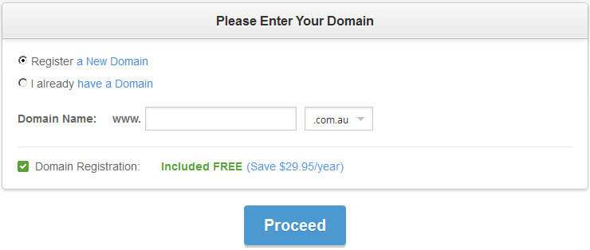
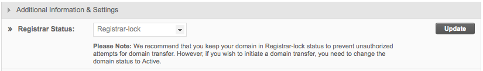

# Website Administrative Procedures – SiteGround
As the 'winner' of the web host comparison in [section 2](https://www.github.com/tzaddik/web-hosting-guide/blob/master/2-Web_Host_Comparison.md), I have chosen to base these how-to guides on SiteGround's server setup.

## Report Menu
* [Introduction and Conclusion](https://www.github.com/tzaddik/web-hosting-guide/blob/master/README.md)
* [1 - Online Purchasing](https://www.github.com/tzaddik/web-hosting-guide/blob/master/1-Online_Purchase.md)
* [2 - Web Host Comparison](https://www.github.com/tzaddik/web-hosting-guide/blob/master/2-Web_Host_Comparison.md)
* [3 - Website Administrative Procedures](https://www.github.com/tzaddik/web-hosting-guide/blob/master/3-Website_Administrative_Procedures.md)

## Table of Contents
1. [Register a domain name](#domain)
2. [Lock/Unlock a domain name](#lock)
3. [Register a domain name as private or public](#private)
4. [Forward a domain name with or without using a mask](#forward)
5. [Transfer a domain name](#transfer)
6. [Create a new FTP user account](#ftp)
7. [Upload/download website content](#content)
8. [Create a database](#database)
9. [Transfer database content from local to remote server](#databasetransfer)
10. [Manage database remotely](#manage)
11. [Install and update WordPress](#wordpress)
12. [Conclusion](#conclusion)

## Register a domain name [^](#top)
Registering a domain with SiteGround is as easy as signing up for a web hosting plan! They offer free domain registration upon sign up, so simply enter your desired domain name into the input box. *\[Figure-1\]*

If you already have an account and want to register additional domain names, you can do this in your **Admin** area. Go to the **Add Services** tab and use the **Register a Domain** input box to check if your desired domain is available. *\[Figure-2\]*

## Lock/Unlock a domain name [^](#top)
Locking your domain is a safeguard against unauthorised domain transfers. It is recommended that you keep it locked at all times unless you are initiating a transfer.

To unlock a domain name at SiteGround, go to **Admin** area -> **My Account** -> **Domain names** -> **Manage** *\[Figure-3\]*

## Register a domain name as private or public [^](#top)
To hide your information in the domain name WHOIS records, you must purchase a **Domain ID Protect** service with SiteGround.

You can either do this when you register the domain, or purchase it later in the **Admin** area, under the **Add Services** tab. *\[Figure-4\]*

## Forward a domain name with or without using a mask [^](#top)
This can be achieved using the **.htaccess** file, by using the Apache command mod_rewrite.

The following example is from the SiteGround [knowledgebase](http://kb.siteground.com/url_masking_with_htaccess/)

*"A sample rewrite rule will look like this: RewriteEngine On RewriteRule ^something/?$ /something/else/ This way each time someone accesses: http://yourdomain.com/something the actual content that will be displayed will be for: http://yourdomain.com/something/else while the URL will remain unchanged."*

## Transfer a domain name [^](#top)
Transfering a domain to SiteGround is as easy as signing up for a web hosting plan! They offer free domain transfers upon sign up, so simply enter your domain name into the input box. The domain has to be [unlocked](#lock) for the transfer to work. *\[Figure-5\]*

If you already have an account and want to register additional domain names, you can do this in your **Admin** area. Go to **Add Services**-> **Domain Transfer** *\[Figure-6\]*

## Create a new FTP user account [^](#top)
Can be done in cPanel at 

## Upload/download website content [^](#top)

## Create a database [^](#top)

## Transfer database content from local to remote server [^](#top)

## Manage database remotely [^](#top)

## Install and update WordPress [^](#top)

##  Conclusion [^](#top)

